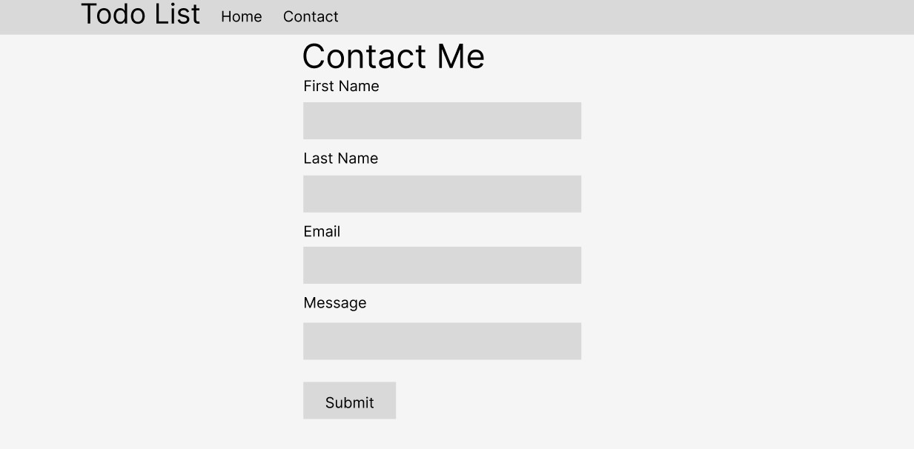
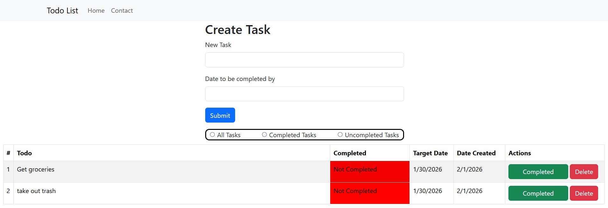

## Project Overview: 
This application allows the user to fill out a form with a task on target date for completion and submit it. Once submitted the task appears in a table where the user can view, toggle between complete and uncomplete, or delete the task. The user can choose to view all tasks, completed tasks, or uncompleted tasks. There is a second page with a controlled contact form.

https://dktomp.github.io/Project3/

## Technologies used: 
- **html**
- **javascript**
- **css**
- **boostrap**
- **react**

## User Stories: 
- **As a user, I want to create a task, so that it can be displayed in a table**
 
- **As a user, I want to set tasks as complete or un complete, so that they can be displayed in individual lists**

- **As a user, I want to sort tasks by all tasks, completed tasks, or uncompleted tasks, so that I can see them sorted into their own lists**

## Wireframes:

## Screenshots:

## Ideas for future improvements:
- **Redesign the form to look better**
- **Redesign the table to look better**
- **Add more styling**

## Author - Dylan Tompkins
<a>www.linkedin.com/in/dylanktompkins</a>